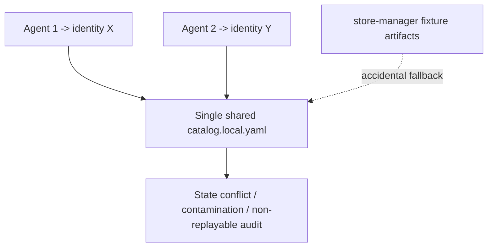

# Roundtable: Multi-Agent × Multi-Identity Binding Governance (v1.4.12)

Date: 2026-02-24  
Type: Governance requirement baseline (doc-first, implementation-ready)  
Status: Proposal-Ready for implementation PR  
Audience: Base-repo architect, audit expert, office-ops expert, runtime operators

---

## 0. Unified Topic + Core Problem Statement

### Topic (统一话题名)

`multi-agent-multi-identity-binding-governance`

### Core problem (统一问题定义)

When multiple agents run in parallel, identity binding becomes unstable unless we enforce **identity-isolated runtime contexts** and **auditable binding evidence**.  
Without hard contracts, demo fixtures (e.g. `store-manager`) can contaminate runtime identities, and one agent’s activation/writeback may override another agent’s state.

### Why now

- v1.4.6+ already closed major local persistence and writeback gaps.
- Next failure frontier is **parallel agent coordination** and **identity binding determinism**.
- We need one governance contract that is machine-checkable across local runtime, CI, and release gates.

---

## 1. Reality check (Is this situation real?)

Yes. This is real and reproducible.

Repository evidence (local + prior audits):

1. Historically, runtime identity evidence/sample selection had non-identity-scoped fallbacks.  
2. Demo fixture contamination (`store-manager`) could leak into non-demo identities via shared patterns.  
3. Single-catalog assumptions were applied to scenarios where users expected multi-agent parallel operation.

Operational evidence:

- Cases where catalog state and META status diverged.
- Cases where one identity pass did not prove another identity pass in same workspace.
- Cases where CI could miss runtime checks under incorrect identity target resolution.

Decision: **Treat multi-agent × multi-identity as a P0 governance topic**, not an optional optimization.

---

## 2. Version boundary (avoid policy ambiguity)

1. v1.4.6 ~ v1.4.11 focused on:
   - local-instance persistence boundary,
   - role-binding hard gates,
   - writeback evidence enforcement,
   - anti-contamination validators.
2. v1.4.12 governance target:
   - formalize multi-agent binding contracts,
   - define allowed topology (shared vs isolated),
   - enforce evidence tuple and promotion arbitration.

---

## 3. Cross-vendor cross-validation (official web + Context7)

> This section is synthesis, not literal vendor endorsement. Conclusions are inferred from official docs + framework references.

### 3.1 OpenAI (official)

Observed from Codex docs:

- Multi-agent workflows reduce context pollution/rot by delegating noisy work to sub-agents.
- Sub-agents should return distilled summaries; write-heavy parallel edits need stronger coordination.
- MCP + Agents SDK flow emphasizes explicit orchestration, handoff boundaries, and traceability.

Governance implication:

- Main agent = policy/control plane.
- Sub-agents = bounded execution units with scoped context and explicit handoff artifacts.
- Identity binding must be explicit in each delegated run, not inherited implicitly from ambient workspace.

### 3.2 Anthropic (official)

Observed from Claude Code subagents/settings docs:

- Subagents have separate context windows.
- Project-level vs user-level agent definitions are clearly layered.
- Tool permissions can be scoped per subagent.

Governance implication:

- Identity runtime should mirror scope layering:
  - project/demo fixture layer,
  - user/local runtime layer.
- Tool permission boundary and identity boundary should be enforced together.

### 3.3 Google Gemini / Vertex / ADK (official)

Observed from Gemini/Vertex/ADK docs:

- Structured outputs (JSON Schema) are emphasized for deterministic agentic workflows.
- ADK describes hierarchical multi-agent composition and explicit transfer/invocation flow.
- Vertex recommends open interoperability in multi-agent systems (A2A references).

Governance implication:

- Binding evidence must be structured and machine-validated (schema-first).
- Transfer between agents must carry explicit target identity context.
- Multi-agent architecture needs deterministic contracts, not implicit process memory.

### 3.4 MCP (official + Context7)

Observed from MCP spec docs:

- Capability negotiation and modular features (`tools`, `resources`, `prompts`) are explicit.
- Tool/resource/prompt exposure must be discoverable and auditable.
- Security guidance emphasizes explicit authorization handling and safe boundaries.

Governance implication:

- Identity binding evidence should align to capability declaration style:
  - explicit, discoverable, machine-validated fields.
- No hidden fallback to unrelated identity artifacts.

### 3.5 Context7 implementation patterns (LangGraph / AutoGen / MCP)

From Context7 retrieval:

- LangGraph patterns reinforce stateful graph control, conditional routing, checkpoint/thread isolation.
- AutoGen patterns reinforce role-based group chat orchestration and explicit participant routing.
- MCP patterns reinforce capability declarations + explicit request/response contracts.

Governance implication:

- Use `agent_session_id` + `identity_context_tuple` as first-class runtime state.
- For parallel agent runs, isolate catalogs/homes or define strict shared-lock semantics.

---

## 4. Architecture baseline: two allowed operating modes

### Mode A (Team Default): Single runtime workspace, single active identity

- One `catalog_path` per runtime root.
- Exactly one active identity in that catalog.
- Suitable for single-agent or serialized control-plane operations.

### Mode B (Parallel): Multi-agent isolated runtime workspaces

- Each agent has its own `IDENTITY_HOME` and `catalog_path`.
- Each workspace can have its own active identity.
- Cross-agent promotion requires arbitration evidence.

### Prohibited mode

- Multiple agents sharing one catalog while independently activating different identities without lock/arbitration.

---

## 5. Hard contracts (machine-checkable)

## 5.1 Identity binding tuple (required in reports)

```json
{
  "agent_id": "office-ops-expert-agent-01",
  "identity_id": "office-ops-expert",
  "identity_home": "/Users/yangxi/.codex/identity",
  "catalog_path": "/Users/yangxi/.codex/identity/catalog.local.yaml",
  "protocol_root": "/abs/path/to/identity-protocol",
  "protocol_commit_sha": "40-hex",
  "protocol_ref": "v1.4.12",
  "agent_session_id": "sess-20260224-001",
  "generated_at": "2026-02-24T10:00:00Z"
}
```

Rules:

1. `identity_home`, `catalog_path`, `protocol_root` MUST be absolute paths.
2. `protocol_commit_sha` MUST be 40 hex chars.
3. `identity_id` MUST exist in `catalog_path`.
4. Missing tuple field => hard fail (no soft pass).

## 5.2 Identity-scoped evidence contract

All runtime evidence/sample/log pattern fields MUST include identity scoping.

Fail conditions:

- Cross-identity match (including `store-manager`) in runtime identity validation.
- Global fallback sample used when identity-specific sample is required.

## 5.3 State consistency contract

Current policy choice (explicit): **dual-write + strong consistency**

- Decision source: `catalog.local.yaml`.
- `META.status` is mandatory mirrored field.
- Any mismatch (`catalog` vs `META`) => fail.

## 5.4 Writeback contract

If upgrade execution indicates `upgrade_required=true && all_ok=true`, then writeback MUST be present:

- RULEBOOK append evidence with matching run id.
- TASK_HISTORY append entry with matching run id.
- report includes `writeback_paths`, `writeback_status`, `writeback_rule_id`.

---

## 6. Multi-agent binding policy (key clarification)

### 6.1 One agent bound to one identity is normal

Supported and expected.

### 6.2 Multiple agents bound to different identities is also normal

Supported **only if** one of these is true:

1. Agents are isolated by different `IDENTITY_HOME` + `catalog_path` (recommended), or
2. Shared catalog mode with strict serialized activation lock (future extension; not default).

### 6.3 What is NOT allowed

- Running Agent A and Agent B against same catalog while both assume independent active identity state.
- Any implicit fallback to demo fixture for runtime identity evidence.

---

## 7. Configuration authority (where to configure)

This section answers: `IDENTITY_HOME`, `IDENTITY_PROTOCOL_HOME`, `catalog_path`, `protocol_root`.

### 7.1 The four keys and why each still matters

1. `IDENTITY_HOME` (runtime data root)
   - Holds local instances + local catalog + runtime logs/reports.
   - Controls **where runtime data lives**.

2. `IDENTITY_PROTOCOL_HOME` (tooling/control root)
   - Points to protocol scripts/validators/contracts checkout.
   - Controls **which governance code version executes**.

3. `catalog_path` (routing source file)
   - Exact file that maps `identity_id -> pack_path/status/profile`.
   - Needed because one `IDENTITY_HOME` may host more than one catalog variant in migration/experiment phases.

4. `protocol_root` (run-resolved execution root)
   - Concrete root used in this run (usually from CLI `--protocol-root` or env resolved).
   - Required for reproducibility because env may differ from final effective root.

### 7.2 Resolution order (baseline)

- `IDENTITY_HOME`: env > runtime-paths.env > `CODEX_HOME/identity` > `~/.codex/identity` > local fallback
- `IDENTITY_PROTOCOL_HOME`: env > explicit CLI > current workspace (compat warning)
- `catalog_path`: CLI `--catalog` > `${IDENTITY_HOME}/catalog.local.yaml`
- `protocol_root`: CLI `--protocol-root` > `IDENTITY_PROTOCOL_HOME` > workspace fallback (warning)

### 7.3 Suggested base configuration files

1. Codex config (recommended): set env export at startup profile.
2. Claude Code settings (`settings.json`): set environment variables at session start.
3. Gemini/ADK runner config: set env in launch scripts or CI job env block.

---

## 8. Diagrams (for roundtable alignment)

### 8.1 Mermaid: allowed topology

```mermaid
flowchart LR
  subgraph ControlPlane[Protocol / Control Plane]
    PR[protocol_root\n(identity protocol checkout)]
    GATES[required gates\nvalidator chain]
  end

  subgraph AgentA[Agent A Session]
    AID[identity_id=A]
    AHOME[IDENTITY_HOME=A_HOME]
    ACAT[catalog_path=A_HOME/catalog.local.yaml]
  end

  subgraph AgentB[Agent B Session]
    BID[identity_id=B]
    BHOME[IDENTITY_HOME=B_HOME]
    BCAT[catalog_path=B_HOME/catalog.local.yaml]
  end

  PR --> GATES
  AID --> ACAT
  BID --> BCAT
  ACAT --> GATES
  BCAT --> GATES
```

### 8.2 Mermaid: prohibited topology (pollution risk)



### 8.3 SVG (lightweight static diagram)

```svg
<svg width="760" height="220" viewBox="0 0 760 220" xmlns="http://www.w3.org/2000/svg">
  <rect x="20" y="20" width="220" height="80" fill="#eef6ff" stroke="#3b82f6"/>
  <text x="32" y="48" font-size="14" font-family="Arial">Agent A</text>
  <text x="32" y="70" font-size="12" font-family="Arial">IDENTITY_HOME=A_HOME</text>
  <text x="32" y="88" font-size="12" font-family="Arial">catalog=A_HOME/catalog.local.yaml</text>

  <rect x="20" y="120" width="220" height="80" fill="#eef6ff" stroke="#3b82f6"/>
  <text x="32" y="148" font-size="14" font-family="Arial">Agent B</text>
  <text x="32" y="170" font-size="12" font-family="Arial">IDENTITY_HOME=B_HOME</text>
  <text x="32" y="188" font-size="12" font-family="Arial">catalog=B_HOME/catalog.local.yaml</text>

  <rect x="300" y="55" width="220" height="110" fill="#f5f3ff" stroke="#7c3aed"/>
  <text x="316" y="82" font-size="14" font-family="Arial">Protocol Root</text>
  <text x="316" y="104" font-size="12" font-family="Arial">validators + creator + installer</text>
  <text x="316" y="124" font-size="12" font-family="Arial">protocol_commit_sha pinned</text>
  <text x="316" y="144" font-size="12" font-family="Arial">evidence tuple enforced</text>

  <rect x="580" y="55" width="160" height="110" fill="#ecfdf5" stroke="#10b981"/>
  <text x="595" y="82" font-size="14" font-family="Arial">Audit Gates</text>
  <text x="595" y="104" font-size="12" font-family="Arial">isolation</text>
  <text x="595" y="122" font-size="12" font-family="Arial">state consistency</text>
  <text x="595" y="140" font-size="12" font-family="Arial">writeback proof</text>

  <line x1="240" y1="60" x2="300" y2="90" stroke="#6b7280" marker-end="url(#arrow)"/>
  <line x1="240" y1="160" x2="300" y2="130" stroke="#6b7280" marker-end="url(#arrow)"/>
  <line x1="520" y1="110" x2="580" y2="110" stroke="#6b7280" marker-end="url(#arrow)"/>

  <defs>
    <marker id="arrow" markerWidth="10" markerHeight="10" refX="9" refY="3" orient="auto" markerUnits="strokeWidth">
      <path d="M0,0 L0,6 L9,3 z" fill="#6b7280"/>
    </marker>
  </defs>
</svg>
```

---


## 8.4 Mermaid: agent-team orchestration with identity-bound sessions

```mermaid
sequenceDiagram
  autonumber
  participant Lead as Lead Agent (Control)
  participant A as Agent A (office-ops-expert)
  participant B as Agent B (base-repo-audit-expert-v3)
  participant Gate as Required Gates

  Lead->>A: run(validate/update) with tuple
(identity_home A, catalog A, protocol_root)
  Lead->>B: run(validate/update) with tuple
(identity_home B, catalog B, protocol_root)
  A-->>Lead: report + writeback evidence
  B-->>Lead: report + writeback evidence
  Lead->>Gate: submit tuple + isolation + consistency evidence
  Gate-->>Lead: PASS/FAIL decision
  Note over Lead,Gate: Missing tuple or cross-identity hit => hard FAIL
```

## 8.5 SVG artifacts (review-ready, richer visuals)

- Topology SVG: `docs/governance/assets/multi-agent-multi-identity-topology-v1.4.12.svg`
- Promotion flow SVG: `docs/governance/assets/multi-agent-promotion-flow-v1.4.12.svg`

Review requirement:

1. SVG files MUST be kept in repository (not external link-only).
2. Diagram updates and governance-rule updates must be in same PR when policy changes.
3. Auditors may reference SVG + Mermaid together; conflicts should block approval.

## 9. P0 implementation tasks (can convert to PR checklist)

1. Report schema hardening (creator/installer/update): enforce binding tuple fields.
2. Add validator: `validate_identity_binding_tuple.py`.
3. Extend existing isolation validator to include `agent_session_id` correlation checks.
4. Add promotion validator for Mode B -> Mode A replay evidence.
5. Add CI gate to block mixed protocol roots without arbitration note.

---

## 10. Acceptance criteria (must all pass)

1. For two parallel agents with separate homes/catalogs:
   - each can activate its own identity without cross-contamination.
2. Any cross-identity evidence/sample hit fails fast.
3. Any catalog/META mismatch fails fast.
4. review-required update cannot pass without writeback evidence.
5. Promotion from isolated run to shared baseline requires arbitration + replay proof.

---

## 11. Release policy (strict)

Before all acceptance criteria + cloud required-gates pass:

- Release status MUST remain `Conditional Go`.
- `Full Go` is prohibited.

---

## 12. Audit checklist

1. Are runtime identities isolated by identity-scoped evidence patterns?
2. Are `IDENTITY_HOME`, `IDENTITY_PROTOCOL_HOME`, `catalog_path`, `protocol_root` all explicit in report evidence?
3. Is there any implicit fallback to demo fixture artifacts?
4. In multi-agent run, are there per-agent session ids and per-agent catalogs?
5. For promotion, is arbitration note present when roots differ?

---

## 13. Sources

### Official web docs

1. OpenAI Codex Multi-agents (concepts):  
   https://developers.openai.com/codex/concepts/multi-agents/
2. OpenAI Codex + Agents SDK guide:  
   https://developers.openai.com/codex/guides/agents-sdk/
3. Anthropic Claude Code Subagents:  
   https://code.claude.com/docs/en/sub-agents
4. Anthropic Claude Code Agent Teams:  
   https://code.claude.com/docs/en/agent-teams
5. Anthropic Claude Code Settings:  
   https://code.claude.com/docs/en/settings
6. Google Gemini Structured Outputs:  
   https://ai.google.dev/gemini-api/docs/structured-output
7. Google ADK Workflow Agents:  
   https://google.github.io/adk-docs/agents/workflow-agents/
8. Google ADK ParallelAgent:  
   https://google.github.io/adk-docs/agents/workflow-agents/parallel-agents/
9. Google Vertex AI Agent Engine develop overview:  
   https://docs.cloud.google.com/vertex-ai/generative-ai/docs/agent-engine/develop/overview
10. Google Vertex AI A2A guide:  
   https://cloud.google.com/vertex-ai/generative-ai/docs/agent-engine/develop/a2a
11. MCP spec (tools/resources/prompts):  
   https://modelcontextprotocol.io/specification/draft/server/tools  
   https://modelcontextprotocol.io/specification/draft/server/resources  
   https://modelcontextprotocol.io/specification/2025-06-18/server/prompts

### Context7 retrieval used

1. LangGraph: `/langchain-ai/langgraph`
2. AutoGen: `/microsoft/autogen`
3. MCP Specification: `/modelcontextprotocol/specification`

---

## 14. Anthropic + Gemini official deep-scan notes (2026-02-24)

This subsection records direct official-source findings used for this governance baseline.

### 14.1 Anthropic official findings

1. Claude Code subagents run in **separate context windows** and support scoped tools/permissions.
   - Source: https://code.claude.com/docs/en/sub-agents
2. Claude Code agent teams are **separate sessions**, with lead + teammates, shared task list, mailbox, and direct teammate messaging.
   - Source: https://code.claude.com/docs/en/agent-teams
3. Claude Code settings support **user/project/local scopes** and project/user subagent locations.
   - Source: https://code.claude.com/docs/en/settings

Governance inference:

- Parallel collaboration requires explicit session boundaries.
- Team mode and subagent mode are distinct and should not share ambiguous runtime identity state.

### 14.2 Gemini / Google official findings

1. ADK workflow agents are deterministic orchestrators (`SequentialAgent`, `ParallelAgent`, `LoopAgent`).
   - Source: https://google.github.io/adk-docs/agents/workflow-agents/
2. `ParallelAgent` executes sub-agents in independent branches with no automatic shared state.
   - Source: https://google.github.io/adk-docs/agents/workflow-agents/parallel-agents/
3. Gemini structured output requires schema-constrained JSON for predictable agentic exchanges.
   - Source: https://ai.google.dev/gemini-api/docs/structured-output
4. Vertex AI Agent Engine recommends A2A for multi-agent interoperability across frameworks.
   - Source: https://docs.cloud.google.com/vertex-ai/generative-ai/docs/agent-engine/develop/overview
   - Source: https://cloud.google.com/vertex-ai/generative-ai/docs/agent-engine/develop/a2a

Governance inference:

- Multi-agent identity governance must assume branch/session isolation by default.
- Promotion across agents/workspaces should rely on structured evidence fields, not implicit state.

## 14. Non-goals (explicit)

1. This document does not claim all scripts already implement every contract above.
2. This document does not replace local persistence governance from v1.4.6.
3. This document does not mandate one vendor framework; it defines protocol-agnostic governance constraints.
