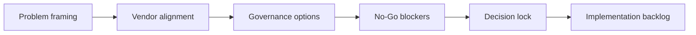
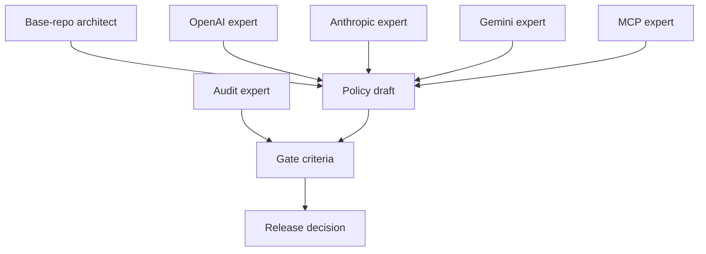

# Roundtable Discussion Playbook: OpenAI × Anthropic × Gemini × MCP (v1.4.12)

Date: 2026-02-24  
Type: Discussion facilitation pack (not test plan)  
Status: Ready for expert roundtable use  
Owner: Base-repo-architect

---

## 1. Objective (讨论目标)

Create a shared governance requirement for **multi-agent × multi-identity binding** that:

1. supports parallel agents without cross-identity contamination;
2. provides deterministic replay evidence across protocol roots;
3. can be converted into hard validators and CI gates.

This playbook is specifically for **discussion and alignment**, not execution testing.

---

## 2. Participants and roles

1. OpenAI-oriented expert (Codex/Agents SDK orchestration)
2. Anthropic-oriented expert (Claude Code subagents/team session model)
3. Gemini-oriented expert (ADK workflow and structured-output determinism)
4. MCP protocol expert (capability contract and interoperability constraints)
5. Identity governance architect (this repository)
6. Audit expert (checks policy enforceability and no-soft-pass criteria)

---

## 3. Unified glossary (先统一术语，避免误解)

1. **Agent Session**: one runtime conversation/execution context.
2. **Identity Context Tuple**: `{identity_id, identity_home, catalog_path, protocol_root, protocol_commit_sha, agent_session_id}`.
3. **Fixture Identity**: demo-only identity (e.g. store-manager), non-runtime source.
4. **Runtime Identity**: local operational identity with writeback expectations.
5. **Promotion**: accepting artifact produced under one mode/root into shared baseline.
6. **Arbitration Note**: structured decision record when roots/modes diverge.

---

## 4. Roundtable agenda (90 minutes)

### Phase A (15 min): Problem framing

- Confirm real-world failure cases:
  - demo contamination,
  - state divergence,
  - ambiguous protocol root.

### Phase B (25 min): Vendor model alignment

- OpenAI: multi-agent orchestration + handoff boundaries
- Anthropic: subagent/session boundary + layered settings
- Gemini: workflow orchestration + schema-first structured output
- MCP: capability declaration + explicit tool/resource contracts

### Phase C (25 min): Governance options

Option 1: single catalog single-active (serialized)  
Option 2: isolated home/catalog per agent (parallel default)  
Option 3: shared catalog + strict distributed lock (future)

### Phase D (15 min): No-Go blockers

- Which conditions block promotion/release immediately?

### Phase E (10 min): Decision lock

- Freeze policy decisions and owners.

---

## 5. Expert question bank (按专家分组)

## 5.1 OpenAI-oriented questions

1. For delegated sub-agents, what minimum context tuple is needed to make replay deterministic?
2. Which handoff metadata should be mandatory when multiple sub-agents can mutate outputs?
3. Where should we draw the line between summary return and raw tool log return?

## 5.2 Anthropic-oriented questions

1. How should we map subagents/team sessions to identity binding boundaries?
2. Which settings scope should own runtime identity defaults (user/project/local)?
3. What guardrails should prevent session-level identity drift?

## 5.3 Gemini-oriented questions

1. What schema fields are mandatory for structured evidence exchange in multi-agent pipelines?
2. For parallel branches, what merge contract should be mandatory before promotion?
3. How should we encode branch provenance for arbitration?

## 5.4 MCP-oriented questions

1. Which capabilities/resources/tools must be declared to make identity context auditable?
2. Should protocol root evidence be modeled as resource metadata, tool result metadata, or both?
3. What is the minimal portable envelope for cross-framework identity replay?

---

## 6. Decision matrix template (会议现场填写)

| Topic | Option A | Option B | Option C | Decision | Owner | Deadline |
|---|---|---|---|---|---|---|
| Parallel mode default | serialized | isolated catalogs | shared lock |  |  |  |
| State source of truth | catalog only | dual-write strong consistency | meta-only |  |  |  |
| Promotion gate | replay only | replay + arbitration | advisory only |  |  |  |
| Demo fixture handling | allow fallback | warn | hard fail |  |  |  |

---

## 7. Required outputs from discussion (不是测试输出)

1. `ROUNDTABLE_DECISIONS.md` (final decisions)
2. `ROUNDTABLE_OPEN_QUESTIONS.md` (unresolved items)
3. `ROUNDTABLE_ARBITRATION_SCHEMA.json` (decision record schema)
4. `ROUNDTABLE_IMPLEMENTATION_BACKLOG.md` (P0/P1/P2 mapping)

---

## 8. Mermaid support diagrams

### 8.1 Discussion flow

### 8.2 Decision authority map

---

## 9. SVG support asset reference

Use with this playbook:

- `docs/governance/assets/multi-agent-multi-identity-topology-v1.4.12.svg`
- `docs/governance/assets/multi-agent-promotion-flow-v1.4.12.svg`
- `docs/governance/assets/roundtable-authority-map-v1.4.12.svg`

These SVG assets are mandatory visual companions for discussion to reduce semantic drift.

---

## 10. Facilitation rules (强约束)

1. No decision without explicit term definitions.
2. No promotion policy without machine-checkable evidence fields.
3. No “best effort pass” language in final policy.
4. If experts disagree, create arbitration item with owner and due date.

---

## 11. Official references (for discussion context)

1. OpenAI Codex multi-agents: https://developers.openai.com/codex/concepts/multi-agents/
2. OpenAI Codex + Agents SDK: https://developers.openai.com/codex/guides/agents-sdk/
3. Anthropic Claude Code sub-agents: https://code.claude.com/docs/en/sub-agents
4. Anthropic Claude Code agent teams: https://code.claude.com/docs/en/agent-teams
5. Anthropic Claude Code settings: https://code.claude.com/docs/en/settings
6. Gemini structured output: https://ai.google.dev/gemini-api/docs/structured-output
7. Google ADK workflow agents: https://google.github.io/adk-docs/agents/workflow-agents/
8. Google ADK parallel agents: https://google.github.io/adk-docs/agents/workflow-agents/parallel-agents/
9. Vertex Agent Engine overview: https://docs.cloud.google.com/vertex-ai/generative-ai/docs/agent-engine/develop/overview
10. Vertex A2A: https://cloud.google.com/vertex-ai/generative-ai/docs/agent-engine/develop/a2a
11. MCP specification: https://modelcontextprotocol.io/specification/draft/server/tools
