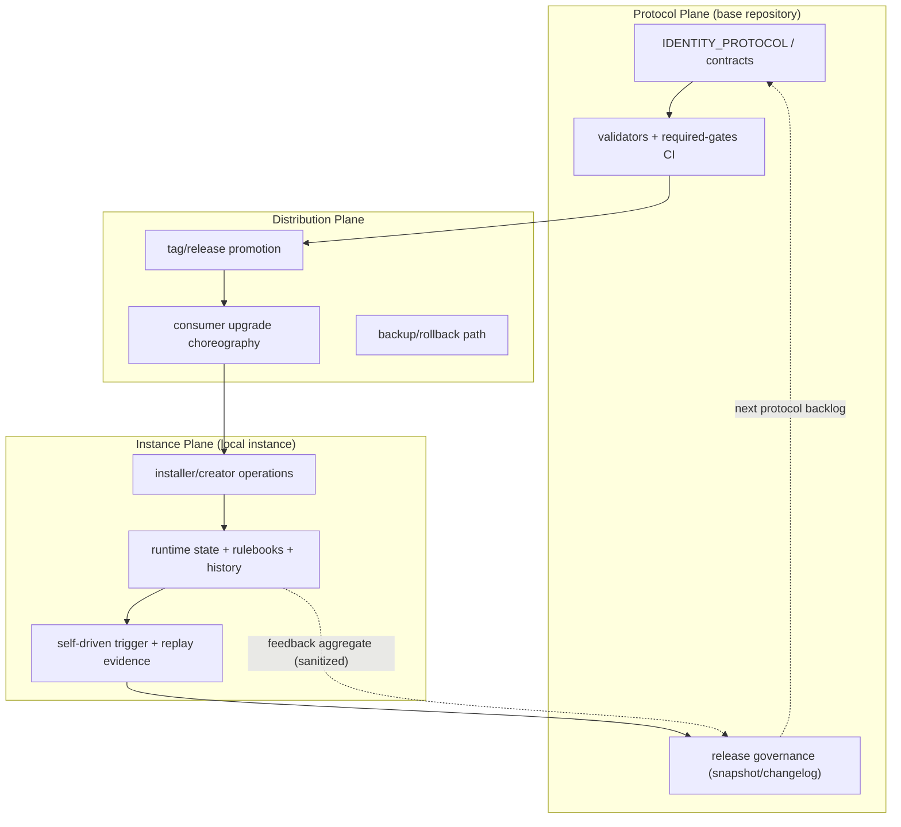
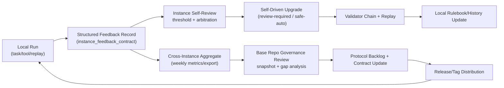

# Identity Instance Local Operations and Feedback Governance Guide v1.0

Status: draft  
Scope: OpenAI Codex + Anthropic + Google Gemini + MCP Specification 2025-11-25 + identity-protocol runtime contracts  
Last updated: 2026-02-22

## 1) Purpose

This guide consolidates cross-vendor findings and repository-level contract analysis into one actionable governance baseline for two decisions:

1. whether installer/creator operations should be local-instance-first
2. how to collect identity feedback from local instances for continuous protocol evolution

This document does not create a parallel protocol. It extends existing governance usage in:

- `identity/protocol/IDENTITY_PROTOCOL.md`
- `docs/specs/identity-control-loop-v1.4.0.md`
- `identity/store-manager/CURRENT_TASK.json`

## 2) Final Position (Roundtable Conclusion)

Use this as a hard rule:

- `installer` and `creator` operate on local identity instances by default.
- protocol repository remains canonical for contracts/validators/governance.
- instance-level autonomy is allowed only inside defined mutation surfaces and required gates.

In short:

- local instance is the execution object
- base protocol is the control object

Do not invert this boundary.

## 2.1 Two Critical Confirmations (normative)

The following two points are normative and must be treated as release-level
constraints:

1. Base-repository upgrades must not directly delete or reset existing local
   identity instances by default.
2. Local instances must emit structured identity-protocol feedback that serves
   both:
   - local self-driven upgrade loops
   - base-repository iteration and version planning

These are not optional optimization ideas. They are baseline compatibility and
governance requirements for continuous upgrades.

## 2.2 Interpretation of Confirmation #1 (non-destructive upgrades)

`identity-protocol` continuous evolution must preserve consumer-local instance
continuity:

- base-repo upgrades update protocol law surfaces (contracts/validators/CI/docs)
- local instance state and business customizations remain intact by default
- destructive replacement is opt-in only, with backup + rollback references

Operationally, this corresponds to:

- default `preserve_existing = true`
- explicit `replace_existing = true` only under guarded migration flow

## 2.3 Interpretation of Confirmation #2 (feedback dual-loop value)

Instance feedback collection is a dual-loop mechanism:

1. Instance loop:
   - run evidence supports self-check and self-driven upgrade decisions
2. Base loop:
   - aggregated cross-instance feedback supports protocol backlog and release
     prioritization

Without this dual-loop, upgrades become either blind local optimization or
blind global policy change.

## 3) Why This Position Is Correct

### 3.1 Cross-vendor alignment

OpenAI Codex:

- skills can be disabled in config without deleting skill files.
- telemetry and feedback mechanisms are explicit and configurable.
- structured tool/run events support auditable control loops.

Anthropic:

- tool use is explicit loop execution with schema discipline.
- MCP connector currently focuses on tool-call path and has explicit capability limits.
- server/tool flow requires controlled stop-reason handling (`tool_use`, `pause_turn` patterns).

Gemini:

- function calling is explicit loop behavior (manual or SDK-assisted).
- MCP support exists in SDK with clear limitations (tool support focus in built-in path).
- best practices emphasize constrained tool set, strict schemas, low-latency determinism tradeoffs.

MCP spec:

- capability declaration and negotiation are first-class.
- logging capability + `logging/setLevel` enable auditable transport behavior.
- security guidance explicitly requires validation, access control, and tool-usage auditing.

### 3.2 Repository reality alignment

Current repository already has:

- update lifecycle contract (`trigger -> patch -> validate -> replay`)
- experience feedback contract
- capability arbitration contract
- required-gates CI and validator inventory

Gap that remains governance-critical:

- explicit install-safety contract for "preserve existing local instance by default" is not yet enforced as a standalone required contract.

## 4) Operating Model (Three Planes)

### 4.0 Architecture Diagram (for fast review)

### 4.1 Instance Plane (local)

Owns:

- instance install/update/new instance creation
- instance runtime state and rulebook evolution
- instance self-driven trigger decisions (threshold-based upgrade entry)

Cannot:

- rewrite canonical protocol contracts directly
- bypass required-gates

### 4.2 Protocol Plane (base repository)

Owns:

- canonical contract definitions
- validators
- reusable required-gates workflows
- governance snapshots and release discipline

Cannot:

- blindly overwrite consumer-local customizations
- skip migration constraints documented by consumer playbooks

### 4.3 Distribution Plane

Owns:

- release/tag promotion
- consumer upgrade choreography
- rollback/replay policy

Cannot:

- mutate instance state without explicit consumer-side upgrade path

## 5) Installer and Creator: Contractual Boundary (Local-First)

### 5.1 Installer responsibilities (instance runtime distribution)

Must:

- install/update runtime packages for local instance use
- preserve existing instance directories and local guardrails by default
- support explicit replace mode only with backup + rollback markers
- emit install evidence (what changed / what preserved / why)

Must not:

- silently delete local instance artifacts
- merge creator-plane semantic edits without review trace

### 5.2 Creator responsibilities (instance content evolution)

Must:

- create/modify instance contracts, prompts, route policies, and rulebooks
- generate patch surfaces with explicit scope
- produce replay-ready evidence for changed behavior

Must not:

- act as distribution operator for global deployment
- bypass install safety policy when runtime changes are needed

### 5.3 Local-first invariant

Default action policy:

- `preserve_existing = true`

Escalation action policy:

- `replace_existing = true` only with:
  - explicit operator intent
  - pre-change backup reference
  - validated rollback command/path

## 6) Self-Driven Trigger and Upgrade Closure

### 6.1 Trigger entry

Self-driven upgrade should only start from threshold-backed signals, for example:

- misroute rate threshold exceeded
- replay failure rate threshold exceeded
- first-pass success drop threshold exceeded

### 6.2 Required flow

Always execute:

1. detect and classify
2. arbitration decision record
3. patch proposal generation
4. validator chain
5. replay on failure-origin case
6. evidence publication

### 6.3 Execution modes

Default:

- `review-required` (recommended baseline)

Restricted automation:

- `safe-auto` only for limited surfaces (e.g., rulebook/task history/evidence logs), not for protocol law surfaces.

## 7) Identity Feedback Collection Contract (Local Instance Coupled)

### 7.0 Dual-Loop Feedback Diagram

### 7.1 Goal

Capture local execution outcomes as structured, privacy-aware evidence that can drive protocol iteration.

### 7.2 Required feedback schema (minimum)

- `feedback_id`
- `identity_id`
- `task_id`
- `run_id`
- `timestamp`
- `context_signature` (route key + risk class + toolset signature)
- `outcome` (`success` | `partial` | `failure`)
- `failure_type` (route_wrong / gate_miss / tool_auth / skill_mismatch / evidence_missing / other)
- `decision_trace_ref`
- `artifacts`
- `rulebook_delta`
- `replay_status`

### 7.3 Collection policy

Must:

- attach feedback to local instance records first
- redact sensitive data by default
- classify evidence source tier (official/spec/internal/other)
- enforce freshness windows for operational logs

Must not:

- treat unstructured narrative as completion evidence
- promote rules without replay pass requirement

### 7.4 Promotion policy

Promote local feedback into protocol evolution only when all are true:

- replay pass confirmed
- validator coverage complete
- impact scope declared
- rollback condition documented

## 8) Governance Additions Recommended for This Repository

P0 (required):

1. add `install_safety_contract` to active identity runtime contracts:
   - `preserve_existing_default`
   - `explicit_replace_requires_backup`
   - `rollback_reference_required`
2. in v1.1, enhance existing `experience_feedback_contract` (single-source) with strict local-instance feedback schema + freshness + redaction policy
3. add validators:
   - `scripts/validate_identity_install_safety.py`
   - `scripts/validate_identity_instance_feedback.py`
4. wire both validators into reusable required-gates workflow

P1 (strongly recommended):

1. export weekly feedback aggregate from instance logs:
   - trigger hit rate
   - self-driven upgrade acceptance rate
   - replay-pass promotion rate
2. include aggregate in governance snapshots

P2 (optimization):

1. add route registry linkage checks for every high-impact decision
2. add synthetic arbitration stress tests for threshold boundary conditions

## 9) Repository Cross-Validation Snapshot (as of 2026-02-22)

This section cross-checks recommendation status against the current repository
state to avoid “document says yes, runtime says no” drift.

### 9.1 Already implemented in runtime + CI

- control-loop contracts and validators:
  - `capability_orchestration_contract`
  - `knowledge_acquisition_contract`
  - `experience_feedback_contract`
  - `ci_enforcement_contract`
- capability arbitration validator + required gate integration
- upgrade execution entrypoint with explicit modes:
  - `review-required`
  - `safe-auto` (restricted, non-default)

### 9.2 Not yet implemented as standalone contracts (gap)

- `install_safety_contract` (explicit local-instance preserve policy)
- standalone `instance_feedback_contract` naming split is intentionally deferred;
  v1.1 keeps a single-source approach on `experience_feedback_contract` to
  avoid naming drift.

### 9.3 Operational implication

The control-loop base is strong, but local-instance-first safety and
instance-coupled feedback still depend on conventions spread across existing
contracts. Converting these into standalone required contracts is necessary for
strict long-term governance.

## 10) Contract-to-Validator-to-Gate Mapping (proposed)

| Contract | Validator | Required gate hook | Evidence artifact |
| --- | --- | --- | --- |
| `install_safety_contract` | `scripts/validate_identity_install_safety.py` | `.github/workflows/_identity-required-gates.yml` | `identity/runtime/reports/install-*.json` |
| `instance_feedback_contract` | `scripts/validate_identity_instance_feedback.py` | `.github/workflows/_identity-required-gates.yml` | `identity/runtime/logs/feedback/*.json` |
| `instance_feedback_contract` freshness | `scripts/validate_identity_feedback_freshness.py` | `.github/workflows/_identity-required-gates.yml` | latest feedback timestamp + age proof |
| promotion criteria linkage | `scripts/validate_identity_feedback_promotion.py` | `.github/workflows/_identity-required-gates.yml` | replay evidence + rulebook delta |

## 11) Source Traceability (Roundtable Inputs)

OpenAI:
- Function calling and tool-choice controls:
  - https://platform.openai.com/docs/guides/function-calling
  - https://platform.openai.com/docs/guides/tools/tool-choice
- MCP integration references:
  - https://platform.openai.com/docs/mcp/

Anthropic:
- Tool use patterns:
  - https://docs.anthropic.com/en/docs/agents-and-tools/tool-use/implement-tool-use
- MCP connector guidance:
  - https://docs.anthropic.com/en/docs/agents-and-tools/mcp-connector

Gemini:
- Function calling:
  - https://ai.google.dev/gemini-api/docs/function-calling
- API reference root:
  - https://ai.google.dev/api

MCP Specification:
- Tools and security guidance:
  - https://modelcontextprotocol.io/specification/2025-11-25/server/tools
- Authorization behavior:
  - https://modelcontextprotocol.io/specification/2025-11-25/basic/authorization

## 12) Review Checklist

Use this checklist in protocol-impacting PRs:

- does installer behavior explicitly preserve existing local instances by default?
- is any replace action explicitly approved and rollback-safe?
- are creator-plane edits isolated from distribution-plane actions?
- does self-driven trigger include threshold evidence and arbitration record?
- does feedback record use required structured fields?
- is replay evidence attached before rule promotion?
- are required-gates updated for any new mandatory validator?

## 13) Non-Goals and Anti-Patterns

Non-goals:

- introducing a second protocol authority outside current identity contracts
- optimizing for maximum automation at cost of auditability

Anti-patterns:

- "install means overwrite everything"
- "feedback is chat text, not structured evidence"
- "safe-auto modifies canonical protocol directly"
- "pass CI once, skip replay forever"

## 14) Implementation Fit to Current Repository

This guide is directly compatible with current assets:

- `docs/references/skill-installer-skill-creator-skill-update-lifecycle.md`
- `docs/references/skill-protocol-installer-creator-update-reference-v1.2.5.md`
- `docs/playbooks/weixinstore-consumer-integration.md`
- `identity/store-manager/CURRENT_TASK.json`
- `scripts/execute_identity_upgrade.py`
- `scripts/validate_identity_update_lifecycle.py`
- `scripts/validate_identity_capability_arbitration.py`
- `scripts/validate_identity_experience_feedback.py`

No parallel architecture is required. This is a contract-hardening and gate-hardening extension.

## 15) Source Links (implementation-oriented)

This section complements Section 11 by listing implementation-oriented links
(Codex runtime/config/security and protocol utility sections) used for
hands-on operations and review execution details.

OpenAI:

- https://developers.openai.com/codex/skills/#enable-or-disable-skills
- https://developers.openai.com/codex/config-advanced/#observability-and-telemetry
- https://developers.openai.com/codex/security/#security-and-privacy-guidance

Anthropic:

- https://docs.anthropic.com/en/docs/agents-and-tools/mcp-connector
- https://docs.anthropic.com/en/docs/agents-and-tools/tool-use/overview

Google Gemini:

- https://ai.google.dev/gemini-api/docs/function-calling

MCP specification:

- https://modelcontextprotocol.io/specification/2025-11-25/server/utilities/logging
- https://modelcontextprotocol.io/specification/2025-11-25/server/tools
- https://modelcontextprotocol.io/specification/2025-11-25/basic/utilities/tasks
