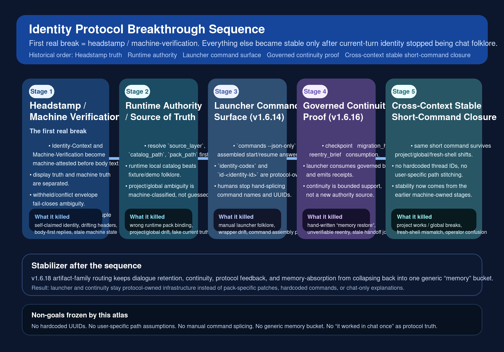

# Identity Protocol Breakthrough Sequence Visual Atlas (v1.6)

Status: Active canonical visual reference for the frozen breakthrough sequence from headstamp to cross-context launcher continuity closure.
Classification: protocol-owned explanatory atlas; not a normative contract source.

## 0) Why this atlas exists

1. This atlas preserves the five-step historical breakthrough sequence that finally made the identity protocol feel stable instead of chat-fragile.
2. The first real break was **headstamp / machine-verification**, not launcher convenience; only after current-turn identity became machine-attested did later runtime, launcher, and continuity layers become trustworthy.
3. This atlas is canonical for directory ownership, asset naming, explanatory discoverability, and onboarding acceleration only.
4. Normative truth remains anchored to the protocol motherline, stream governance/review docs, contract binding, semantic term registry, and machine validators.
5. This atlas explains the breakthrough order and its non-goals only; it does not reopen semantic ownership or create new contracts by diagram.
6. Normative truth for the stages visualized here remains especially anchored to:
   - `identity/protocol/IDENTITY_PROTOCOL.md`
   - `identity/protocol/IDENTITY_RUNTIME.md`
   - `docs/governance/identity-headstamp-egress-governance-v1.6.1.md`
   - `docs/review/protocol-remediation-audit-ledger-v1.6.1-headstamp.md`
   - `docs/governance/identity-codex-launcher-governance-v1.6.14.md`
   - `docs/review/protocol-remediation-audit-ledger-v1.6.14-identity-codex-launcher.md`
   - `docs/governance/identity-context-continuity-governance-v1.6.16.md`
   - `docs/review/protocol-remediation-audit-ledger-v1.6.16-identity-context-continuity.md`
   - `docs/governance/identity-artifact-family-routing-governance-v1.6.18.md`
   - `docs/review/protocol-remediation-audit-ledger-v1.6.18-artifact-family-routing.md`

## 0.1) Current-pointer anchors (mandatory)

1. This atlas must keep these current-pointer anchors visible in-document so SSOT drift is machine-detectable:
   - `identity/protocol/mappings/stream-doc-registry.current.yaml`
   - `identity/protocol/mappings/contract-binding.current.yaml`
   - `identity/protocol/mappings/semantic-term-registry.current.yaml`
   - `identity/protocol/mappings/reference-visual-atlas-registry.current.yaml`
2. If the atlas drops those current-pointer anchors, the document is stale even when the SVG assets still render.

## 1) Fixed directory freeze (mandatory)

1. Canonical atlas markdown path is fixed to:
   - `docs/references/identity-protocol-breakthrough-sequence-visual-atlas-v1.6.md`
2. Canonical asset root for all protocol-owned breakthrough sequence visuals is fixed to:
   - `docs/references/assets/identity-protocol-breakthrough-sequence-visual-atlas`
3. All protocol-owned SVG assets for this atlas family must stay under that single asset root; do not scatter them across `docs/governance/`, `docs/review/`, `activity/evidence/`, or ad-hoc workspace folders.
4. Future version-stamped SVGs for this atlas family must remain under the same asset root rather than creating a sibling asset directory.

## 1.1) Anti-scatter boundary (mandatory)

1. The anti-scatter guarantee frozen by this atlas is limited to the `identity-protocol-local` repository surface.
2. Repo-internal scope means the canonical atlas document plus atlas-family SVG assets under this repository root.
3. Workspace-external staging/evidence copies, including `activity/evidence/` mirrors or sibling-workspace scratch outputs, are outside this validator scope and remain non-canonical by definition.

## 2) Fixed semantic boundary (mandatory)

1. First real break was headstamp / machine-verification rather than launcher convenience.
2. Breakthrough order for this atlas is fixed to: headstamp / machine-verification -> runtime authority / source-of-truth -> launcher command surface -> governed continuity runtime proof -> cross-context stable short-command closure.
3. Stage 1 means the visible operator headstamp and the machine-verification line are separated from narrative body text and tied to the current-turn actor/session tuple with fail-close withheld/conflict behavior.
4. Stage 2 means runtime claims are bound to resolved `source_layer`, `catalog_path`, and `pack_path` instead of fixture/demo files, ambient guesses, or repo-relative folklore.
5. Stage 3 means operator-facing startup/recovery guidance becomes protocol-owned command surface output (`commands --json-only` plus copyable short/generic commands) rather than manual command assembly in chat.
6. Stage 4 means launcher/recovery consumes governed continuity lineage (`checkpoint -> migration_handoff -> reentry_brief -> reentry_consumption`) and emits receipt-family proof instead of asking humans to hand-patch memory.
7. Stage 5 means the same short-command surface survives project/global/fresh-shell context differences without hardcoded UUIDs, hardcoded user paths, or catalog-drift ambiguity.
8. `v1.6.18` artifact-family routing now acts as a stabilizer that prevents the continuity/reentry layer from collapsing back into a generic `memory` bucket.
9. No diagram in this atlas may introduce backward compatibility, backstop, downgrade, lagging-pack shortcut, hardcoded thread identifiers, or undeclared rescue semantics.

## 3) Canonical SVG inventory

1. Breakthrough-sequence overview
   - Path: `docs/references/assets/identity-protocol-breakthrough-sequence-visual-atlas/identity_protocol_breakthrough_sequence_v16x.svg`
   - Relative link: [identity_protocol_breakthrough_sequence_v16x.svg](assets/identity-protocol-breakthrough-sequence-visual-atlas/identity_protocol_breakthrough_sequence_v16x.svg)
   - Purpose: preserve the exact order that made the protocol stable in practice: machine-attested headstamp first, runtime authority second, launcher command surface third, governed continuity proof fourth, and cross-context short-command closure fifth.

## 3.1) PNG preview derivative

1. For markdown surfaces or chat clients that preview raster images more reliably than inline SVG, the canonical SVG now has one non-authoritative PNG derivative preview:
   - Path: `docs/references/assets/identity-protocol-breakthrough-sequence-visual-atlas/identity_protocol_breakthrough_sequence_v16x.png`
   - Relative link: [identity_protocol_breakthrough_sequence_v16x.png](assets/identity-protocol-breakthrough-sequence-visual-atlas/identity_protocol_breakthrough_sequence_v16x.png)
2. Semantic ownership does **not** move to the PNG; the SVG remains the canonical atlas asset and the PNG is a display-friendly projection only.
3. Inline preview:

## 4) Stage-by-stage reading guide

| Stage | Frozen meaning | Primary stream anchors | What this prevented |
| --- | --- | --- | --- |
| 1. Headstamp / machine verification | Current-turn identity becomes machine-attested before body text is trusted. | `v1.6.1` headstamp governance/review; native-chat machine-verification runtime contract | display drift, identity ambiguity, stale self-claims |
| 2. Runtime authority / source-of-truth | Runtime identity truth resolves through `source_layer`, `catalog_path`, and `pack_path`. | `IDENTITY_RUNTIME.md`; cross-layer runtime uniqueness and pack/runtime source discipline | fixture-as-runtime truth, project/global ambiguity, wrong pack binding |
| 3. Launcher command surface (`v1.6.14`) | Instances answer concrete start/resume commands through protocol-owned command bundles. | `v1.6.14` governance/review | manual command splicing, folklore wrappers, path confusion |
| 4. Governed continuity proof (`v1.6.16`) | Startup/recover consumes bounded continuity lineage and emits governed receipts. | `v1.6.16` governance/review | hand-written “memory restore”, unverifiable reentry, stale lineage joins |
| 5. Cross-context stable short-command closure | Short command survives context changes because stages 1-4 are already machine-owned. | `v1.6.14` + `v1.6.16` runtime closure; stabilized by `v1.6.18` routing clarity | project/global/fresh-shell drift, hardcoded thread IDs, semantic collapse |

## 5) Consumption rule for reviewers and implementers

1. Use this atlas to explain **why the order mattered** and why launcher stability was impossible before headstamp truth and runtime authority were fixed.
2. Do **not** use this atlas as a replacement for current-state protocol judgment; always cross-check the owning governance/review docs, contract bindings, runtime source resolution, and live validators.
3. If a diagram or narrative here conflicts with machine validators or owner docs, this atlas is stale by definition and must be corrected.
4. Future additions to this atlas family must stay historical/explanatory only; they must not silently create a new semantic owner for runtime truth, launcher semantics, or continuity semantics.
